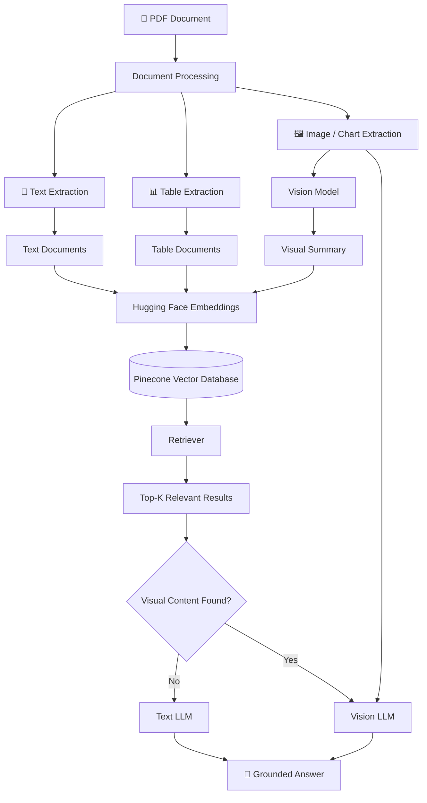
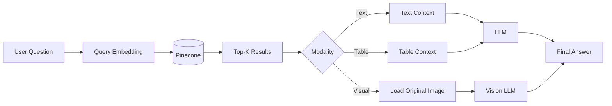
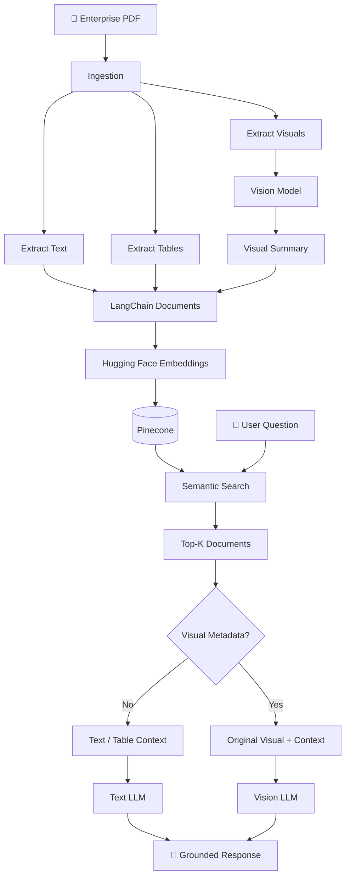

# 🧠 Multimodal RAG — Understand Any PDF, Not Just Its Text


A production-style **Multimodal Retrieval-Augmented Generation (RAG)** pipeline that extracts, indexes, retrieves, and reasons over everything inside a PDF — **text, tables, images, charts, graphs, and diagrams** — not just the plain text.

---

## 📌 Why This Exists

Most RAG pipelines only read plain text. But real enterprise documents — financial reports, technical manuals, market research — pack their most important information into tables, charts, and diagrams. Plain-text extraction quietly breaks on all of it:

- Tables get flattened, and row/column relationships are lost.
- Numbers inside charts and trend lines are dropped entirely.
- Flowcharts, architecture diagrams, and process maps become unreadable noise.

**This project fixes that** by converting every content type into searchable embeddings while keeping the original visual evidence available for the final answer.

---

## 📐 Architecture

```
                               ┌─────────────────────────────────────────┐
                               │             PDF Ingestion               │
                               └────────────────────┬────────────────────┘
                                                     │
                 ┌───────────────────────────────────┼───────────────────────────────────┐
                 ▼                                   ▼                                   ▼
        ┌─────────────────┐                ┌──────────────────┐                ┌──────────────────┐
        │ Text Extraction │                │ Table Extraction  │                │ Visual Extraction│
        │   (PyMuPDF)     │                │ (Markdown Format) │                │ (Images/Charts)  │
        └────────┬────────┘                └────────┬──────────┘                └────────┬─────────┘
                 │                                   │                                    ▼
                 │                                   │                          ┌──────────────────┐
                 │                                   │                          │   Vision Model   │
                 │                                   │                          │ (Visual Summary) │
                 │                                   │                          └────────┬─────────┘
                 └───────────────────┬───────────────┴─────────────────────────────────┘
                                     │
                                     ▼
                          ┌─────────────────────┐
                          │  Text Embedding      │
                          │      Model           │
                          └──────────┬───────────┘
                                     ▼
                          ┌─────────────────────┐
                          │ Pinecone Vector DB  │
                          └──────────┬───────────┘
                                     ▼
                          ┌─────────────────────┐
                          │ Similarity Search   │
                          │    (User Query)     │
                          └──────────┬───────────┘
                                     │
                    ┌────────────────┴────────────────┐
                    ▼                                  ▼
         [Visual Artifact Found?]              [Text / Table Only]
                    │ YES                              │ NO
                    ▼                                  ▼
         ┌──────────────────┐               ┌──────────────────┐
         │ Vision Language  │               │     Text LLM     │
         │      Model       │               │                  │
         └────────┬─────────┘               └────────┬─────────┘
                  └──────────────────┬─────────────────┘
                                     ▼
                          ┌─────────────────────┐
                          │  Final Answer +     │
                          │  Source Citation    │
                          └─────────────────────┘
```

### Mermaid Diagram (renders natively on GitHub)



---

## ⚙️ How It Works

### 1. Modality Extraction & Normalization
Each uploaded PDF is split into three channels:
- **Text** — extracted with page-aware metadata
- **Tables** — converted to Markdown to preserve row/column alignment
- **Visuals** — extracted as images and passed to a vision model to generate a factual, descriptive summary

### 2. Vector Store Ingestion
Text, table Markdown, and visual summaries are all embedded through a single **text embedding model** and stored in one **Pinecone namespace**. Each vector's metadata records:
- The original page number
- The modality (`text`, `table`, or `visual`)
- A local reference path to the original image (if applicable)

### 3. Adaptive Query Routing
- The query is embedded and matched against Pinecone for the top-K results.
- If none of the results are visual → the context goes to a **standard text LLM**.
- If a visual result is retrieved → its image is pulled from the metadata, and both the image and surrounding text are passed to a **Vision Language Model (VLM)** for exact reading.



---

## 📸 Examples

### Text Retrieval
**Q:** *What was NovaCore's FY2026 revenue?*
**A:** `$132.0 Million` — sourced from the Page 2 narrative.

### Table Reasoning
| Region | 2026 Revenue | YoY Growth | Customers | CSAT |
|---|---|---|---|---|
| Europe | $41.2M | 31% | 118 | 4.7/5 |
| North America | $38.6M | 27% | 104 | 4.6/5 |
| Asia Pacific | $34.9M | 24% | 96 | 4.8/5 |
| Middle East | $17.3M | 18% | 51 | 4.5/5 |

**Q:** *Which region grew fastest, and which had the highest CSAT?*
**A:** **Europe** grew fastest (**31% YoY**); **Asia Pacific** had the best CSAT (**4.8/5**). Table structure is preserved at index time, so columns align correctly during retrieval.

### Chart & Trend Analysis
**Q:** *Which quarter had the highest revenue, and what's the trend?*
**A:** **Q4 2026** peaked at **~$37.8M**, with steady quarter-over-quarter growth through 2025–2026. The chart is summarized in text for search, and the raw image is re-read by the VLM for exact figures.

### Diagram Reasoning
**Q:** *Where's the critical quality-control point in the supply chain?*
**A:** The **Quality Lab in Singapore**, where every batch completes thermal, network, and firmware testing before export to regional hubs. Nodes and arrows in the flowchart are interpreted directly by the vision model.

### Pie Chart Proportion
**Q:** *What percentage of the Penang facility's electricity came from solar?*
**A:** **34%** — the second-largest source behind grid electricity (51%).

---

## 🌟 Key Advantages

| Advantage | Description |
|---|---|
| **Unified Vector Namespace** | Text, tables, and visuals all live in one Pinecone index — no separate stores to manage |
| **Zero Visual Evidence Loss** | Raw images are kept and re-read by a Vision Model instead of relying solely on text summaries |
| **Adaptive Routing** | The Vision LLM is only invoked when a visual result is actually retrieved, saving cost |
| **Metadata Grounding** | Every answer cites its source page, table, or figure |

---

## 🛠️ Tech Stack

- **Python 3.10+**
- **LangChain** — orchestration
- **Pinecone** — vector database
- **PyMuPDF** — text/layout extraction
- **Hugging Face Embeddings** — text vectorization
- **Vision-Language Model** — chart, diagram, and image understanding

---

## 🚀 Complete RAG Lifecycle



---

## 📚 Use Cases

- **Business & Financial Reports** — annual reports, KPI dashboards, quarterly filings
- **Industrial Documents** — process diagrams, factory layouts, QC workflows
- **Product Documents** — catalogs, spec sheets, comparison tables
- **Enterprise Knowledge Bases** — SOPs, policies, technical docs, presentation exports

---

## 📈 Future Improvements

- Hybrid search & reranking
- Metadata filtering
- Multi-vector / parent-child retrieval
- Query rewriting & context compression
- OCR for scanned PDFs
- Dedicated vision embeddings & multimodal reranking
- LangGraph-based agentic routing
- Evaluation framework
- Conversation memory & streaming responses

---

## 📄 License

Distributed under the MIT License. See [`LICENSE`](./LICENSE) for details.