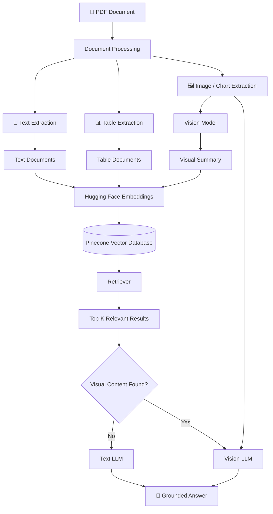
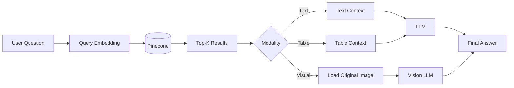
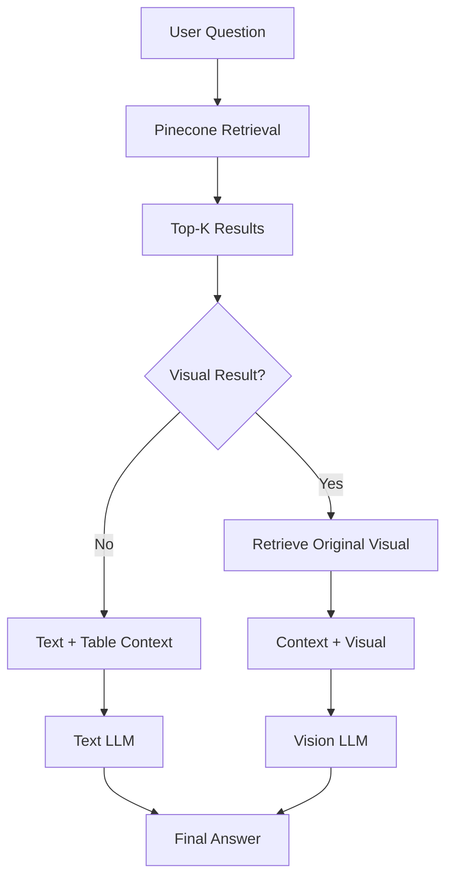
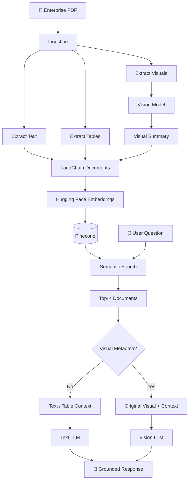

# 🔎 Multimodal RAG with LangChain & Pinecone

A simple and production-oriented **Multimodal Retrieval-Augmented Generation (RAG)** pipeline that allows users to ask questions about information contained in:

* 📄 Text
* 📊 Tables
* 📈 Charts
* 🖼️ Images
* 🔗 Diagrams

The system combines **LangChain**, **Hugging Face embeddings**, **Pinecone Vector Database**, and **LLM/Vision LLM** models to retrieve relevant information from enterprise PDF documents.

---

## 📌 Overview

Traditional RAG systems generally extract text from a PDF, split it into chunks, create embeddings, and store those embeddings in a vector database.

This works well when the answer exists in text.

However, real-world enterprise PDFs often contain information in:

* Tables
* Graphs
* Charts
* Images
* Diagrams
* Visual relationships

For example:

> "Which quarter had the highest revenue?"

The answer may exist only inside a graph and may not appear as a normal sentence in the PDF.

A multimodal RAG system addresses this by processing **text, tables, and visual content separately while keeping them searchable through a unified retrieval layer.**

---

# 🏗️ Architecture

## High-Level Architecture



---

# 🔄 End-to-End Process

```text
                    ┌─────────────────────┐
                    │     PDF Document    │
                    └──────────┬──────────┘
                               │
                               ▼
                    ┌─────────────────────┐
                    │  Document Parsing   │
                    └──────────┬──────────┘
                               │
              ┌────────────────┼────────────────┐
              │                │                │
              ▼                ▼                ▼
          📝 Text          📊 Tables       🖼️ Visuals
              │                │                │
              │                │                ▼
              │                │          Vision Model
              │                │                │
              │                │                ▼
              │                │        Visual Summary
              │                │                │
              └────────────────┼────────────────┘
                               │
                               ▼
                    Hugging Face Embeddings
                               │
                               ▼
                     ┌──────────────────┐
                     │     Pinecone     │
                     │  Vector Database │
                     └────────┬─────────┘
                              │
                              ▼
                         User Query
                              │
                              ▼
                     Semantic Retrieval
                              │
                              ▼
                         Top-K Results
                              │
                              ▼
                    ┌──────────────────┐
                    │ Visual detected? │
                    └────────┬─────────┘
                             │
                    ┌────────┴────────┐
                    │                 │
                   NO                YES
                    │                 │
                    ▼                 ▼
                Text LLM         Vision LLM
                                      │
                                      │
                         + Original Visual
                                      │
                    └────────┬────────┘
                             ▼
                       Final Answer
```

---

# 🎯 Why Multimodal RAG?

A traditional text-only RAG pipeline looks like:

```text
PDF
 ↓
Extract Text
 ↓
Chunk Text
 ↓
Create Embeddings
 ↓
Pinecone
 ↓
Retrieve Text
 ↓
LLM
```

The problem is that visual information can be lost or flattened.

### Example

A PDF contains a revenue graph:

```text
Q1 → $28M
Q2 → $31M
Q3 → $35M
Q4 → $37.8M
```

A user asks:

> Which quarter had the highest revenue?

If the graph is not properly processed, a text-only RAG system may not have the required information.

Multimodal RAG instead creates a searchable representation of the visual:

```text
Visual
  ↓
Vision Model
  ↓
"Quarterly revenue increases throughout the year
and peaks in Q4 at approximately $37.8M."
  ↓
Embedding
  ↓
Pinecone
```

The original visual is still retained for final verification/reasoning.

---

# 🧩 Supported Modalities

| Modality    | Processing          | Stored Representation              |
| ----------- | ------------------- | ---------------------------------- |
| 📝 Text     | PDF text extraction | Text embedding                     |
| 📊 Tables   | Table extraction    | Structured/Markdown text embedding |
| 📈 Charts   | Vision model        | Visual summary embedding           |
| 🖼️ Images  | Vision model        | Visual summary embedding           |
| 🔗 Diagrams | Vision model        | Visual summary embedding           |

All searchable representations can be stored in the same Pinecone namespace.

---

# 🗂️ Project Structure

A recommended project structure:

```text
multimodal-rag/
│
├── data/
│   └── documents/
│       └── company_report.pdf
│
├── images/
│   ├── charts/
│   ├── diagrams/
│   └── extracted/
│
├── src/
│   ├── ingestion.py
│   ├── embeddings.py
│   ├── vectorstore.py
│   ├── retriever.py
│   └── generation.py
│
├── notebooks/
│   └── multimodal_rag.ipynb
│
├── .env
├── .gitignore
├── requirements.txt
└── README.md
```

---

# 🛠️ Technology Stack

| Component            | Technology                           |
| -------------------- | ------------------------------------ |
| Programming Language | Python                               |
| RAG Framework        | LangChain                            |
| PDF Processing       | PyMuPDF                              |
| Embeddings           | Hugging Face / Sentence Transformers |
| Vector Database      | Pinecone                             |
| Text Generation      | LLM                                  |
| Visual Reasoning     | Vision LLM                           |
| Data Processing      | Pandas                               |
| Image Processing     | Pillow                               |

---

# 📦 Installation

## 1. Clone the repository

```bash
git clone https://github.com/<your-username>/multimodal-rag.git

cd multimodal-rag
```

---

## 2. Create a virtual environment

### Windows

```bash
python -m venv venv

venv\Scripts\activate
```

### Linux / macOS

```bash
python3 -m venv venv

source venv/bin/activate
```

---

## 3. Install dependencies

```bash
pip install -U \
    langchain \
    langchain-core \
    langchain-groq \
    langchain-huggingface \
    langchain-pinecone \
    pinecone \
    sentence-transformers \
    pymupdf \
    groq \
    pandas \
    tabulate \
    pillow
```

Or:

```bash
pip install -r requirements.txt
```

---

# 🔐 Environment Variables

Create a `.env` file:

```env
PINECONE_API_KEY=your_pinecone_api_key
GROQ_API_KEY=your_groq_api_key
```

Load the environment variables:

```python
import os
from dotenv import load_dotenv

load_dotenv()

PINECONE_API_KEY = os.environ["PINECONE_API_KEY"]
GROQ_API_KEY = os.environ["GROQ_API_KEY"]
```

> ⚠️ Never commit `.env` or API keys to GitHub.

Add this to `.gitignore`:

```gitignore
.env
venv/
__pycache__/
*.pyc
```

---

# 📄 Step 1 — Load the PDF

For normal text extraction:

```python
from langchain_community.document_loaders import PyPDFLoader

PDF_PATH = r"data/documents/company_report.pdf"

loader = PyPDFLoader(PDF_PATH)

raw_docs = loader.load()

print("Loaded documents:", len(raw_docs))
print("Source:", raw_docs[0].metadata.get("source"))
```

For multimodal processing, the PDF is additionally processed to identify:

```text
TEXT
TABLES
VISUALS
```

---

# ✂️ Step 2 — Create Documents

The extracted information is converted into LangChain documents.

### Text document

```python
Document(
    page_content="FY2026 revenue reached USD 132.0 million...",
    metadata={
        "page": 2,
        "modality": "text"
    }
)
```

### Table document

```python
Document(
    page_content="| Region | Revenue | Growth | CSAT | ... |",
    metadata={
        "page": 4,
        "modality": "table"
    }
)
```

### Visual document

```python
Document(
    page_content="Quarterly revenue increases and peaks in Q4...",
    metadata={
        "page": 7,
        "modality": "visual",
        "image_path": "images/charts/revenue.png"
    }
)
```

The important idea is:

```text
Same retrieval system
        │
        ├── Text
        ├── Tables
        └── Visual summaries
```

---

# 🤖 Step 3 — Generate Embeddings

Use a Hugging Face embedding model:

```python
from langchain_huggingface import HuggingFaceEmbeddings

embeddings = HuggingFaceEmbeddings(
    model_name="sentence-transformers/all-MiniLM-L6-v2"
)
```

The embedding model converts searchable content into vectors:

```text
Text
 ↓
Embedding
 ↓
[0.023, -0.184, 0.731, ...]
```

The same embedding approach can be used for:

```text
Text
Table representation
Visual summary
```

---

# 🗄️ Step 4 — Create Pinecone Index

```python
from pinecone import Pinecone, ServerlessSpec
import os
import time

INDEX_NAME = "multimodal-rag-kb"
NAMESPACE = "multimodal-rag"

pc = Pinecone(
    api_key=os.environ["PINECONE_API_KEY"]
)

if not pc.has_index(INDEX_NAME):

    pc.create_index(
        name=INDEX_NAME,
        dimension=384,
        metric="cosine",
        spec=ServerlessSpec(
            cloud="aws",
            region="us-east-1",
        ),
    )

    while not pc.describe_index(INDEX_NAME).status["ready"]:
        time.sleep(2)

print("Pinecone index ready:", INDEX_NAME)
```

> `384` corresponds to the vector dimension of `all-MiniLM-L6-v2`.

If you change the embedding model, make sure the Pinecone index dimension matches the embedding dimension.

---

# 📥 Step 5 — Insert Documents

Create the vector store:

```python
from langchain_pinecone import PineconeVectorStore

vectorstore = PineconeVectorStore(
    index_name=INDEX_NAME,
    embedding=embeddings,
    namespace=NAMESPACE,
)
```

Insert documents:

```python
vectorstore.add_documents(documents)

print("Documents uploaded to Pinecone.")
```

The process becomes:

```text
Documents
    ↓
Embedding Model
    ↓
Vectors
    ↓
Pinecone
```

---

# 🔎 Step 6 — Create Retriever

```python
retriever = vectorstore.as_retriever(
    search_kwargs={
        "k": 4
    }
)
```

Now the system can perform semantic search.

Example:

```python
query = "Which region had the highest CSAT?"

results = retriever.invoke(query)

for result in results:
    print(result.page_content)
    print(result.metadata)
```

---

# 🔄 Retrieval Process



---

# 🖼️ Visual Retrieval Strategy

The system does **not need to store raw image pixels as the searchable vector representation**.

Instead:

```text
Chart Image
     ↓
Vision Model
     ↓
Factual Visual Summary
     ↓
Text Embedding
     ↓
Pinecone
```

Example:

```text
Original Chart

        ↓

Vision Model

        ↓

"Revenue increases every quarter and reaches
approximately $37.8M in Q4 2026."

        ↓

Embedding

        ↓

Pinecone
```

The original image path is retained in metadata:

```python
metadata = {
    "page": 7,
    "modality": "visual",
    "image_path": "images/charts/revenue.png"
}
```

This allows the system to retrieve the visual summary and then load the original image for final visual reasoning.

---

# 🧠 Query-Time Routing

The first implementation can keep routing simple.



### Text/table question

```text
Question
   ↓
Pinecone
   ↓
Text/Table results
   ↓
Text LLM
   ↓
Answer
```

### Visual question

```text
Question
   ↓
Pinecone
   ↓
Visual summary
   ↓
Original image
   ↓
Vision LLM
   ↓
Answer
```

---

# 📊 Example Queries

## Text Question

```text
What was NovaCore's FY2026 revenue?
```

Expected retrieval:

```text
modality = text
```

Answer:

```text
NovaCore's FY2026 revenue was $132.0 million.
```

---

## Table Question

```text
Which region had the highest CSAT?
```

Relevant table:

```text
Europe          4.7/5
North America   4.6/5
Asia Pacific    4.8/5
Middle East     4.5/5
```

Answer:

```text
Asia Pacific had the highest CSAT at 4.8/5.
```

---

## Chart Question

```text
Which quarter had the highest revenue?
```

The system can:

```text
Retrieve visual summary
        ↓
Load original chart
        ↓
Vision LLM
        ↓
Answer
```

Answer:

```text
Q4 2026, at approximately $37.8 million.
```

---

## Diagram Question

```text
Where is the critical quality-control point?
```

The system retrieves the diagram summary and original visual.

Answer:

```text
The Quality Lab in Singapore.
```

---

# 🗃️ Pinecone Data Model

A typical record can contain:

```text
ID
│
├── vector
│
├── page_content
│
└── metadata
     ├── page
     ├── modality
     ├── source
     ├── image_path
     └── table_number
```

Example:

```python
{
    "page": 7,
    "modality": "visual",
    "source": "NovaCore_Report.pdf",
    "image_path": "images/charts/revenue.png"
}
```

---

# 🏷️ Modality Metadata

Use metadata to distinguish different content types.

```python
{
    "modality": "text"
}
```

or:

```python
{
    "modality": "table"
}
```

or:

```python
{
    "modality": "visual"
}
```

This makes it possible to perform modality-aware routing later.

---

# 🔁 Rebuilding the Knowledge Base

When documents are updated, the namespace can be cleared before re-indexing.

```python
index = pc.Index(INDEX_NAME)

index.delete(
    delete_all=True,
    namespace=NAMESPACE,
)
```

Then:

```python
vectorstore.add_documents(documents)
```

Result:

```text
Old vectors
    ↓
Delete namespace
    ↓
Process new documents
    ↓
Generate embeddings
    ↓
Upload new vectors
```

### ⚠️ Important

Do **not** execute `delete_all=True` as part of the normal question-answering flow.

It belongs in your **ingestion/re-indexing process**.

---

# 🔌 Loading an Existing Pinecone Index

For the application/query layer, connect to the existing index instead of uploading documents again.

```python
from pinecone import Pinecone
from langchain_pinecone import PineconeVectorStore

pc = Pinecone(
    api_key=os.environ["PINECONE_API_KEY"]
)

index = pc.Index(INDEX_NAME)

vectorstore = PineconeVectorStore(
    index=index,
    embedding=embeddings,
    namespace=NAMESPACE,
)

retriever = vectorstore.as_retriever(
    search_kwargs={
        "k": 4
    }
)
```

This flow is:

```text
Existing Pinecone Index
        ↓
Connect
        ↓
VectorStore
        ↓
Retriever
        ↓
User Query
```

No document ingestion is required.

---

# 🆚 `from_documents()` vs `add_documents()`

### Option 1 — `from_documents()`

```python
vectorstore = PineconeVectorStore.from_documents(
    documents=chunks,
    embedding=embeddings,
    index_name=INDEX_NAME,
    namespace=NAMESPACE,
)
```

Convenient for initial ingestion.

```text
Documents
   ↓
Embeddings
   ↓
VectorStore
   ↓
Pinecone
```

---

### Option 2 — `add_documents()`

```python
vectorstore = PineconeVectorStore(
    index=index,
    embedding=embeddings,
    namespace=NAMESPACE,
)

vectorstore.add_documents(chunks)
```

Useful when you want explicit control over the vector store and ingestion process.

```text
Connect VectorStore
       ↓
add_documents()
       ↓
Embeddings
       ↓
Pinecone
```

---

# 🏭 Recommended Production Separation

Separate **indexing** from **querying**.

## Indexing Pipeline

```text
                ┌───────────────┐
                │ PDF Documents │
                └───────┬───────┘
                        ↓
                 Document Parser
                        ↓
             ┌──────────┼──────────┐
             ↓          ↓          ↓
           Text       Tables     Visuals
             │          │          ↓
             │          │     Vision Model
             │          │          ↓
             └──────────┴── Visual Summary
                        ↓
                   Embeddings
                        ↓
                    Pinecone
```

Run this when documents are added or updated.

---

## Query Pipeline

```text
User Question
      ↓
Query Embedding
      ↓
Pinecone
      ↓
Top-K Results
      ↓
Check Metadata
      ↓
┌─────┴──────┐
│            │
Text/Table  Visual
│            │
↓            ↓
Text LLM   Vision LLM
│            │
└─────┬──────┘
      ↓
Final Answer
```

Run this whenever a user asks a question.

---

# 🚀 Complete RAG Lifecycle



---

# ⚡ Key Design Principles

### 1. Keep modalities separate during ingestion

```text
Text
Tables
Visuals
```

should be identifiable through metadata.

---

### 2. Use summaries for visual retrieval

Instead of trying to perform semantic search directly over raw pixels:

```text
Image
 ↓
Vision Summary
 ↓
Text Embedding
 ↓
Pinecone
```

---

### 3. Keep the original visual

Do not discard the original chart/image after creating its summary.

Store its reference:

```python
image_path = "images/charts/revenue.png"
```

The visual can then be supplied to the Vision LLM when required.

---

### 4. Use one retrieval layer

Text, table representations, and visual summaries can share:

```text
Pinecone Index
      +
Namespace
      +
Embedding Model
```

This gives the system a unified semantic search layer.

---

### 5. Keep the first implementation simple

You do not necessarily need an agent framework or complex routing for the initial implementation.

A simple flow is sufficient:

```text
Question
   ↓
Retrieve
   ↓
Check modality
   ↓
Text LLM / Vision LLM
   ↓
Answer
```

---

# 🔒 Security

Never commit API credentials.

Bad:

```python
PINECONE_API_KEY = "xxxxxxxx"
```

Good:

```python
PINECONE_API_KEY = os.environ["PINECONE_API_KEY"]
```

Use:

```text
.env
```

and add it to:

```text
.gitignore
```

---

# 🧪 Testing Checklist

Before considering the pipeline complete, test:

### Text

* [ ] Retrieve normal paragraphs
* [ ] Answer factual questions
* [ ] Verify source page

### Tables

* [ ] Preserve rows and columns
* [ ] Retrieve table correctly
* [ ] Answer comparison questions

### Charts

* [ ] Extract chart
* [ ] Generate visual summary
* [ ] Store summary embedding
* [ ] Retrieve chart using semantic query
* [ ] Load original image

### Images

* [ ] Extract image
* [ ] Generate description
* [ ] Store metadata
* [ ] Retrieve image

### Diagrams

* [ ] Preserve diagram
* [ ] Preserve relationships
* [ ] Verify visual answer

### Pinecone

* [ ] Index created
* [ ] Correct embedding dimension
* [ ] Correct namespace
* [ ] Documents uploaded
* [ ] Retrieval working

---

# 📈 Future Improvements

The initial architecture can be extended with:

* Hybrid search
* Reranking
* Metadata filtering
* Multi-vector retrieval
* Parent-child retrieval
* Query rewriting
* Context compression
* OCR for scanned PDFs
* Better table parsing
* Dedicated vision embeddings
* Multimodal reranking
* Evaluation framework
* LangGraph-based agentic routing
* Source/page citations
* Conversation memory
* Streaming responses

---

# 🧠 Traditional RAG vs Multimodal RAG

| Feature                  |  Traditional RAG |                   Multimodal RAG |
| ------------------------ | ---------------: | -------------------------------: |
| Text                     |                ✅ |                                ✅ |
| Tables                   |     ⚠️ Flattened |                     ✅ Structured |
| Images                   |      ❌ / Limited |                                ✅ |
| Charts                   |      ❌ / Limited |                                ✅ |
| Diagrams                 |      ❌ / Limited |                                ✅ |
| Semantic Retrieval       |                ✅ |                                ✅ |
| Vision Model             |                ❌ |                                ✅ |
| Original Visual Evidence | Usually not used |                                ✅ |
| Unified Retrieval        |             Text | Text + Tables + Visual summaries |

---

# 📚 Example Use Cases

This architecture is useful for enterprise documents such as:

### 🏢 Business Reports

```text
Annual reports
Financial reports
Management reports
Business reviews
```

### 💰 Financial Documents

```text
Revenue charts
Financial tables
KPI dashboards
Quarterly reports
```

### 🏭 Industrial Documents

```text
Process diagrams
Factory layouts
Quality-control diagrams
Technical reports
```

### 🛒 Product Documents

```text
Product catalogs
Product images
Specifications
Comparison tables
```

### 📑 Enterprise Knowledge Bases

```text
Policies
SOPs
Technical documentation
Internal reports
Presentations converted to PDF
```

---

# 📊 Example Knowledge Flow

A single PDF page may contain:

```text
┌────────────────────────────────────────────┐
│                PDF PAGE                    │
│                                            │
│  Company Revenue increased significantly   │
│                                            │
│  ┌──────────────────────────────────────┐  │
│  │ Region      Revenue    Growth        │  │
│  │ Europe      $41.2M     31%           │  │
│  │ Asia        $34.9M     24%           │  │
│  └──────────────────────────────────────┘  │
│                                            │
│              📈 Revenue Chart              │
│                                            │
└────────────────────────────────────────────┘
```

The ingestion pipeline converts it into:

```text
TEXT DOCUMENT
      +
TABLE DOCUMENT
      +
VISUAL DOCUMENT
```

Then:

```text
              ┌───────────────┐
              │   Pinecone    │
              └───────┬───────┘
                      │
          ┌───────────┼───────────┐
          ↓           ↓           ↓
        Text        Table      Visual
       Vector       Vector      Vector
```

All can be searched through the same retrieval layer.

---

# 🎯 Core Concept

The central idea of this project is:

> **Make every useful piece of information retrievable, while preserving the original evidence needed for accurate final reasoning.**

In simplified form:

```text
PDF
 ↓
Extract
 ↓
┌─────────┬──────────┬──────────┐
│  Text   │  Tables  │ Visuals  │
└────┬────┴─────┬────┴────┬─────┘
     │          │         │
     │          │    Vision Model
     │          │         │
     └──────────┴────┬────┘
                     ↓
                Embeddings
                     ↓
                 Pinecone
                     ↓
                  Retrieve
                     ↓
             ┌───────┴───────┐
             ↓               ↓
          Text LLM       Vision LLM
             │               │
             └───────┬───────┘
                     ↓
                Final Answer
```

---

# ⭐ Project Summary

**Multimodal RAG** extends traditional RAG by allowing a knowledge base to represent information from **text, tables, images, charts, and diagrams**.

The system uses:

```text
PyMuPDF
    ↓
LangChain Documents
    ↓
Hugging Face Embeddings
    ↓
Pinecone
    ↓
Semantic Retrieval
    ↓
Text LLM / Vision LLM
```

This provides a simple foundation for building enterprise-grade document question-answering systems where important information is not limited to plain text.

---

## 📄 License

Add your preferred license here, for example:

```text
MIT License
```

---

## 👨‍💻 Author

**Your Name**

Built with:

`Python` · `LangChain` · `Hugging Face` · `Pinecone` · `LLM` · `Vision LLM`
